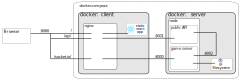

Elevation of Privilege
======================
[](https://travis-ci.org/dehydr8/elevation-of-privilege)
[](https://codeclimate.com/github/dehydr8/elevation-of-privilege/maintainability)
[](https://codeclimate.com/github/dehydr8/elevation-of-privilege/test_coverage)

Elevation of Privilege (EoP) is the easy way to get started and learn threat modeling. It is a card game that developers, architects or security experts can play.

The deployed version can be found here: https://elevation-of-privilege.herokuapp.com/

## Running
There are two components that need to be started in order to run the game.
1. Server
2. UI/Client

### Development/local
The server can be started using:
```
npm run server
```
There are 3 [koa](https://koajs.com/) apps that bind on the respective ports:

| Application | Description | Environment Variable | Default |
|-------------|-------------------------------------------------------------------|----------------------|---------|
| Server | The game server for boardgame, exposes socket.io endpoints | `SERVER_PORT` | 8000 |
| Lobby API | Internal API for lobby operations, should not be exposed publicly | `INTERNAL_API_PORT` | 8002 |
| Public API | Public API to create games and retrieve game info | `API_PORT` | 8001 |

The UI can be started using:
```
npm run start
```
The UI can also be built and served statically, keep in mind that the values of the port numbers will be hard coded in the generated files.

### Docker
To start a dockerized version of the EoP game use

```bash
docker-compose up --build
```

This would start EoP on port `8080` and would be accessible at `http://localhost:8080/`.
The docker-compose setup starts two container: 
 * `threats-client`: running `nginx` as a reverse proxy and serving the react application
 * `threats-server`: running the `nodejs` backends: public API and game server



## TODO
* Spectator mode
* UI fixes (optimizations, smaller screens)
* Upload an image instead of a model. Might need restructuring as we rely on diagram components + reporting would change
* Optimize the card sprite sheet (can look at SVGs)
* Improve test coverage, write tests for possible game states and moves
* Refactor and have reusable components
* Optimize component renders through `shouldComponentUpdate`
* Write contributing guide

## Credits
The game was originally invented by [Adam Shostack](https://adam.shostack.org/) at Microsoft. The [EoP Whitepaper](http://download.microsoft.com/download/F/A/E/FAE1434F-6D22-4581-9804-8B60C04354E4/EoP_Whitepaper.pdf) written by Adam can be downloaded which describes the motivation, experience and lessons learned in creating the game.

The motivation for creating this online version of the game at Careem was due to a large number of teams working remotely across several geographies and we wanted to scale our method of teaching threat modeling to our engineering teams.

The game is built using [boardgame.io](https://boardgame.io/), a framework for developing turn based games. The graphics, icons and card images used in this version were extracted from the original card game built by Microsoft.

Made with :green_heart: at Careem
